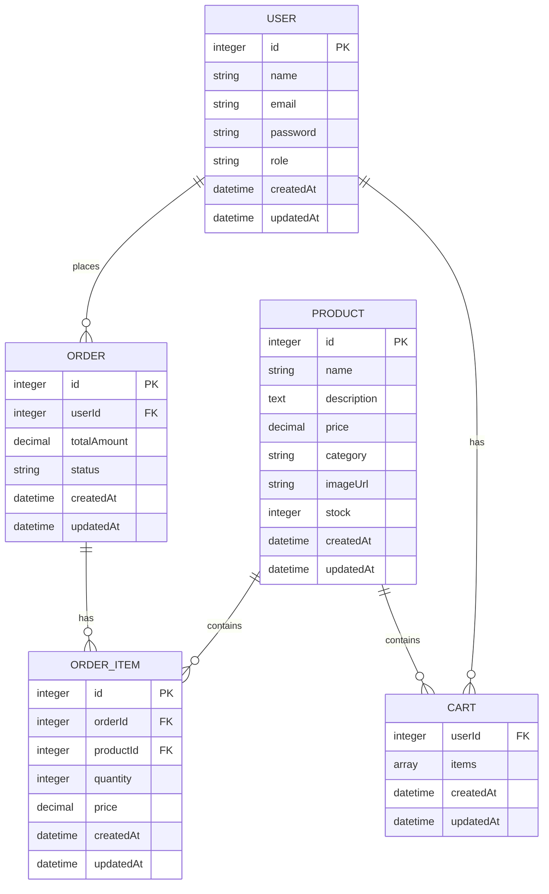

# Data Models

```mermaid
erDiagram
    USER ||--o{ ORDER : places
    USER ||--o{ CART : has
    PRODUCT ||--o{ ORDER_ITEM : contains
    PRODUCT ||--o{ CART : contains
    ORDER ||--o{ ORDER_ITEM : has

    USER {
        integer id PK
        string name
        string email
        string password
        string role
        datetime createdAt
        datetime updatedAt
    }

    PRODUCT {
        integer id PK
        string name
        text description
        decimal price
        string category
        string imageUrl
        integer stock
        datetime createdAt
        datetime updatedAt
    }

    ORDER {
        integer id PK
        integer userId FK
        decimal totalAmount
        string status
        datetime createdAt
        datetime updatedAt
    }

    ORDER_ITEM {
        integer id PK
        integer orderId FK
        integer productId FK
        integer quantity
        decimal price
        datetime createdAt
        datetime updatedAt
    }

    CART {
        integer userId FK
        array items
        datetime createdAt
        datetime updatedAt
    }
```