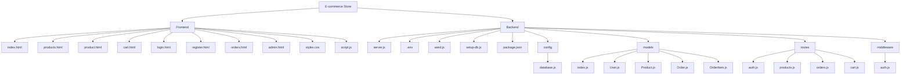

# Project Structure

```mermaid
graph TD
    A[E-commerce Store] --> B[Frontend]
    A --> C[Backend]
    
    B --> B1[index.html]
    B --> B2[products.html]
    B --> B3[product.html]
    B --> B4[cart.html]
    B --> B5[login.html]
    B --> B6[register.html]
    B --> B7[orders.html]
    B --> B8[admin.html]
    B --> B9[styles.css]
    B --> B10[script.js]
    
    C --> C1[server.js]
    C --> C2[.env]
    C --> C3[seed.js]
    C --> C4[setup-db.js]
    C --> C5[package.json]
    
    C --> C6[config]
    C6 --> C61[database.js]
    
    C --> C7[models]
    C7 --> C71[index.js]
    C7 --> C72[User.js]
    C7 --> C73[Product.js]
    C7 --> C74[Order.js]
    C7 --> C75[OrderItem.js]
    
    C --> C8[routes]
    C8 --> C81[auth.js]
    C8 --> C82[products.js]
    C8 --> C83[orders.js]
    C8 --> C84[cart.js]
    
    C --> C9[middleware]
    C9 --> C91[auth.js]
```